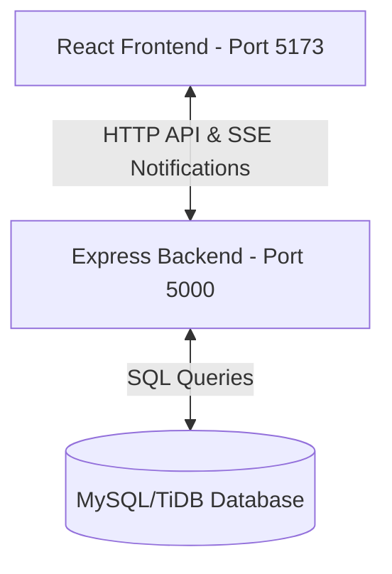
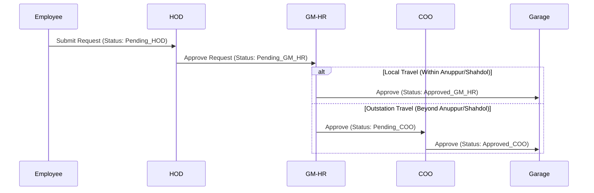
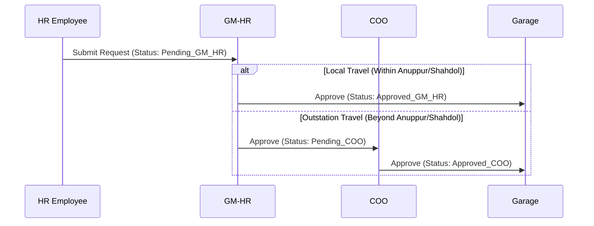

# Vehicle Requisition Portal — User & Developer Manual

Welcome to the **Vehicle Requisition Portal** documentation. This manual provides a clear, high-level overview of the application's architecture, user roles, database entities, requisition routing workflows, and guidelines for local development.

---

## 1. System Overview

The **Vehicle Requisition Portal** is an enterprise web application designed to automate the process of requesting corporate vehicles, managing approval flows, and tracking fleet logs (maintenance, fuel, and driver availability).

### Technology Stack
* **Frontend**: React (Vite-powered, client-side routing with React Router v6), Tailwind CSS (for styling), and Lucide React (icons).
* **Backend**: Node.js & Express.js, JWT Cookie-based Session Authentication (Passport.js), and Server-Sent Events (SSE) for real-time notifications.
* **Database**: MySQL / TiDB Cloud Serverless database.

---

## 2. System Architecture & Routing



### Main Directories
* `/client`: React project folder containing components, pages, routing, and assets.
* `/server`: Node/Express codebase containing DB config, repositories, services, controllers, and middlewares.

---

## 3. Database Schema

The portal manages organization structure, user identity, and fleet lifecycle using the following key database tables:

| Table Name | Primary Purpose | Key Fields |
| :--- | :--- | :--- |
| `employees` | User profile data, password hashes, and system roles. | `id`, `employee_number`, `email`, `full_name`, `role`, `department_id` |
| `departments` | Organizational groupings linked to campus structures. | `id`, `name`, `code`, `campus_id` |
| `vehicles` | Vehicles details, statuses, and odometer readings. | `id`, `registration_no`, `make`, `model`, `status`, `current_odometer` |
| `drivers` | Driver licenses, expirations, and trip assignments. | `id`, `license_number`, `is_active`, `is_available` |
| `vehicle_requests` | Requisition details, destinations, travel dates, and routing statuses. | `id`, `employee_id`, `department_id`, `destination`, `travel_type`, `status` |
| `vehicle_maintenance` | Servicing schedules and maintenance items. | `id`, `vehicle_id`, `scheduled_date`, `description`, `status` |
| `fuel_logs` | Diesel or petrol log sheets containing volume and costs. | `id`, `vehicle_id`, `liters`, `cost`, `odometer_reading` |
| `driver_feedbacks` | Ratings and remarks for drivers after completed trips. | `id`, `request_id`, `rating`, `comments` |
| `audit_logs` | System logs capturing security and operations actions. | `id`, `employee_id`, `action_type`, `table_name`, `row_id` |

---

## 4. Requisition Routing Workflows

Approval routing is determined by the **requester's role**, the **requester's department**, and the **travel type** (either *"Within Anuppur/Shahdol"* for local travel, or *"Beyond Anuppur/Shahdol"* for outstation travel).

---

### Standard Department Flow
*(Applies to Bamboo, Finance, IT, Operations, etc.)*



---

### Custom HR Department Flow
*(Regular Employees of the HR department skip HOD approval and go directly to GM-HR)*



---

### Special Self-Requisitions
1. **HOD Submits Requisition**:
   - Bypasses HOD step $\rightarrow$ Starts directly at `Pending_GM_HR`.
2. **GM-HR Submits Requisition**:
   - If *Within Anuppur/Shahdol* $\rightarrow$ Auto-approves immediately as `Approved_GM_HR` (sent to Garage).
   - If *Beyond Anuppur/Shahdol* $\rightarrow$ Bypasses HOD and GM-HR steps, starting at `Pending_COO`.
3. **COO Submits Requisition**:
   - Auto-approves immediately as `Approved_COO` (sent to Garage).

---

## 5. Role-Based Dashboards & Features

### 👤 Employee Dashboard
* **My Requests Table**: View request history, check statuses, and read remarks.
* **New Requisition Form**: Submit requests specifying pickup, destination, travel type, passenger counts, and attachments.
* **Trip Actions**: Edit or Delete requests while they are still in their initial pending state.
* **Feedback System**: Once the trip is marked `Completed` by the Garage, the Employee can submit feedback and rate (1-5 stars) the driver.

### 👥 HOD Dashboard
* **Pending Approvals Table**: Approve or reject requests originating from employees in their department.
* **Approval History**: Search and review past actions.

### 👔 GM-HR Dashboard
* **Pending Approvals Table**: Approve or reject second-level requests.
* **HR Department HOD Representation**: In the table, the GM-HR is dynamically displayed as the HOD for all HR employee requisitions (instead of returning N/A).
* **Global Statistics**: Track totals for pending, approved, rejected, and deleted requests.

### 🏛 COO Dashboard
* **Pending COO Approvals Table**: Final-level sanction for outstation requests (`Beyond Anuppur/Shahdol`).
* **HOD Approval Sign-off**: Displays status/remarks of the preceding HOD approvals.

### 🔧 Garage Dashboard
* **Pending Vehicle Assignment Table**: View all approved requests (both `Approved_GM_HR` and `Approved_COO`).
* **Dispatch Actions**: 
  - **Assign**: Pair an available vehicle and driver to a request (changes status to `Vehicle_Assigned`).
  - **Record Pickup**: Start the journey (status changes to `In_Transit`).
  - **Record Drop-off**: Conclude the trip (status changes to `Completed`), which frees up the vehicle and driver and enables user feedback.
* **Vehicle & Driver Management**:
  - Add and update vehicle records.
  - Set driver availability. **Validation Rule**: A driver cannot be set to "On Leave" or deactivated if they are currently on an active assignment (`is_available = 0`).
* **Servicing & Fuel Logs**:
  - Log maintenance schedules and track log status (`Scheduled`, `In_Progress`, `Completed`, `Cancelled`).
  - Log fuel volumes (liters), expenditures, and odometer readings.
  - **Export Features**: Export PDF logs (using `jspdf` and `autoTable`) or Excel logs (using `xlsx.js`) with complete cost and liters summary.

### ⚙ Admin Dashboard
* **Manage Employees**: Edit, create, deactivate, and assign roles (`Employee`, `HOD`, `GM-HR`, `COO`, `Garage`, `Admin`) to organization members.
* **Manage Departments**: Add new departments (such as `"Bamboo"`) and coordinate budgets.
* **Audit Logs**: Trace all security, authorization, and requisition database events (including creation, updates, and deletes) grouped chronologically with IP addresses and user agents.

---

## 6. Local Development Setup

If a new developer pulls this project, they can get started with the following steps:

### 1. Database Setup
1. Verify that your MySQL server is running.
2. Run the SQL schema script:
   ```bash
   mysql -u root -p < server/schema.sql
   mysql -u root -p < server/seed.sql
   ```
3. Set your environment variables in a `.env` file under the `/server` directory:
   ```env
   PORT=5000
   NODE_ENV=development
   DB_HOST=localhost
   DB_PORT=3306
   DB_USER=root
   DB_PASSWORD=yourpassword
   DB_NAME=vehicle_requisition_portal
   JWT_SECRET=your_super_secret_jwt_key
   CLIENT_URL=http://localhost:5173
   ```

### 2. Run the Project
1. Run local installation script from the project root:
   ```bash
   npm install
   ```
2. Start both the client and backend servers in development mode:
   ```bash
   npm run dev
   ```
3. Access the portal at:
   - **Frontend**: `http://localhost:5173`
   - **API Backend**: `http://localhost:5000`
   - **Swagger API Docs**: `http://localhost:5000/api-docs`

### 3. Run Integration Tests
To execute end-to-end routing testing against the local server, run the API audit script:
```bash
cd server
node api_test.js
```
