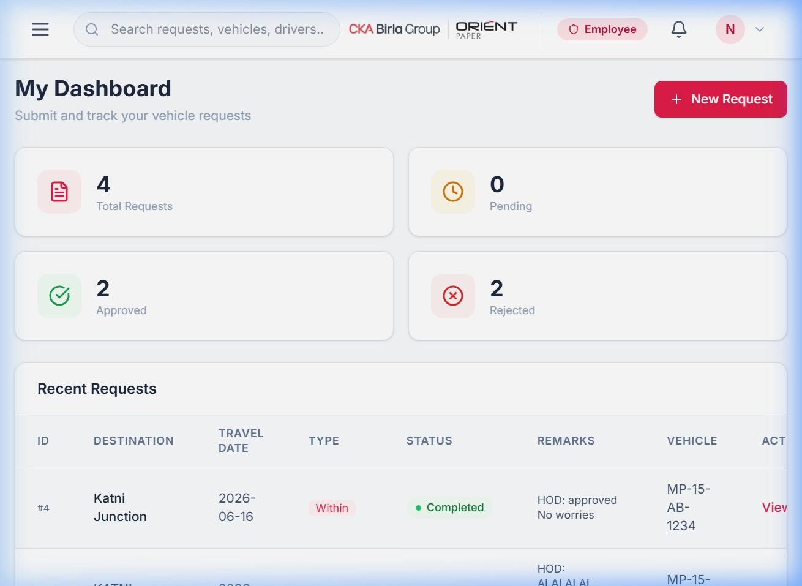
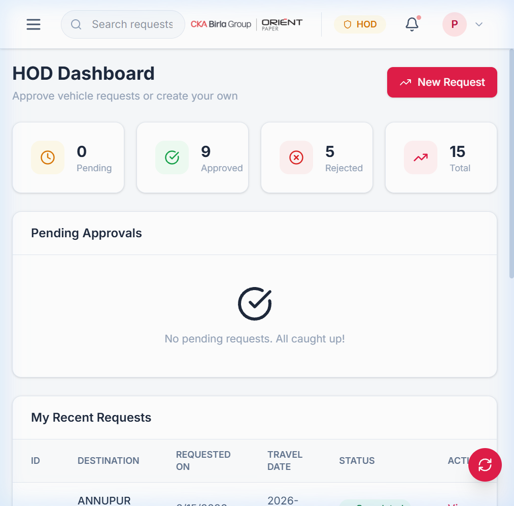
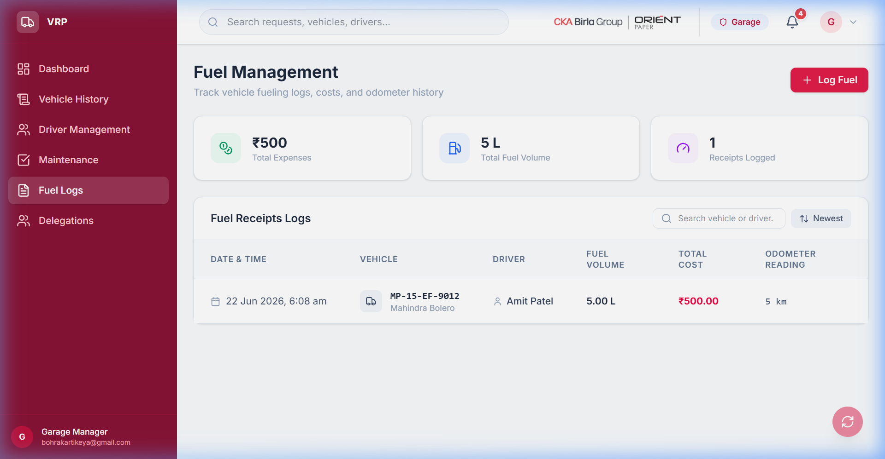
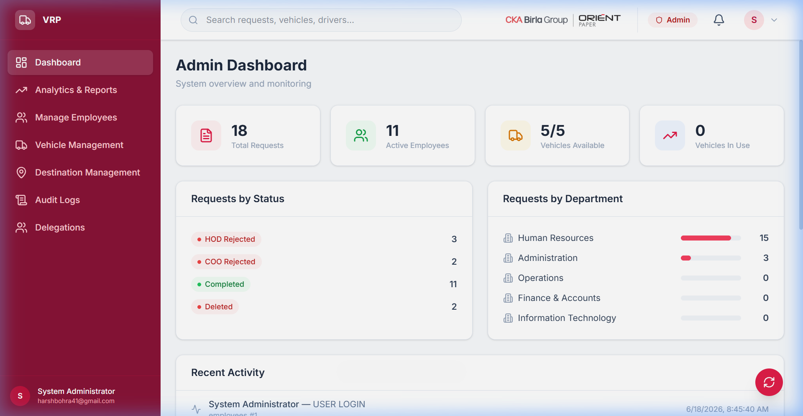

# 🚗 Vehicle Requisition Portal

[](https://react.dev/)
[](https://vite.dev/)
[](https://tailwindcss.com/)
[](https://nodejs.org/)
[](https://expressjs.com/)
[](https://www.mysql.com/)
[](https://en.pingcap.com/tidb-cloud/)

An enterprise-grade **Vehicle Requisition Portal** designed to automate vehicle request submissions, multi-level approval workflows (HOD $\rightarrow$ GM-HR $\rightarrow$ COO), real-time notifications via Server-Sent Events (SSE), and comprehensive garage operations (dispatching, maintenance scheduling, and fuel tracking).

---

## 📸 Screenshots & Portal Guide

### 1. Requisition & Tracking (Employee)
Employees can submit local or outstation travel requests, track their requests on an active timeline, and submit driver feedback once a trip is completed.



---

### 2. Department Approvals (HOD)
Heads of Departments (HODs) can view pending approvals for their department, check metrics, and review approval history.



---

### 3. Servicing & Logs (Garage Manager)
Garage operators manage vehicle assignments, track active dispatches, and log vehicle maintenance and fuel logs with Excel/PDF exporting.



---

### 4. Enterprise Administration (Admin)
Administrators manage system configurations, coordinate departments/budgets, toggle active employees, and view complete security audit logs.



---

## ⚡ Main Features

* **Multi-Level Approvals**: Dynamic routing from Employee $\rightarrow$ HOD $\rightarrow$ GM-HR $\rightarrow$ COO based on travel destination, department code, and roles.
* **Custom HR Workflows**: Custom logic allowing HR department employees to bypass HODs and direct self-requisition auto-approvals for GM-HR.
* **Live Notifications**: Instant user feedback and approval status alerts pushed via Server-Sent Events (SSE).
* **Leave Validations**: Robust safeguards preventing operators from deactivating or putting a driver "On Leave" if they are currently on a trip.
* **Fleet Reporting**: Print/Download custom PDF reports and Excel logs summarizing fuel logs, liters, total expenditures, and maintenance schedules.
* **Security Audit Logs**: Track administrative edits, deactivations, and requests with detailed timestamps, IP addresses, and actors.

---

## 🛠 Local Setup & Installation

Detailed guidelines on database scripts, configuration, and API routes can be found in our [Developer & User Manual](./DEVELOPER_USER_MANUAL.md).

### Quick Start:

1. **Clone & Install**:
   ```bash
   git clone https://github.com/HBCoder31/Vehicle_Requisition_JS.git
   cd Vehicle_Requisition_JS
   npm install
   ```

2. **Database Setup**:
   Create a database named `vehicle_requisition_portal` in your MySQL/TiDB database, and run:
   ```bash
   mysql -u root -p vehicle_requisition_portal < server/schema.sql
   mysql -u root -p vehicle_requisition_portal < server/seed.sql
   ```

3. **Configure Environment**:
   Create a `.env` file under the `server` directory using the `.env.example` template:
   ```env
   PORT=5000
   DB_HOST=localhost
   DB_USER=root
   DB_PASSWORD=your_password
   DB_NAME=vehicle_requisition_portal
   JWT_SECRET=change_me
   CLIENT_URL=http://localhost:5173
   ```

4. **Run Application**:
   ```bash
   # Run both client and server concurrently
   npm run dev
   ```

5. **Test Backend API**:
   ```bash
   cd server
   node api_test.js
   ```
